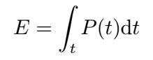
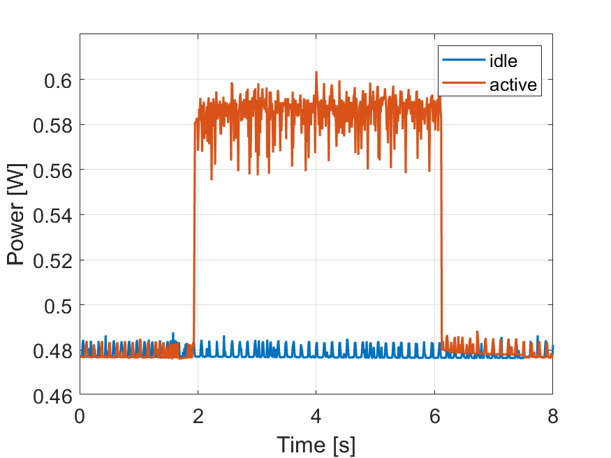
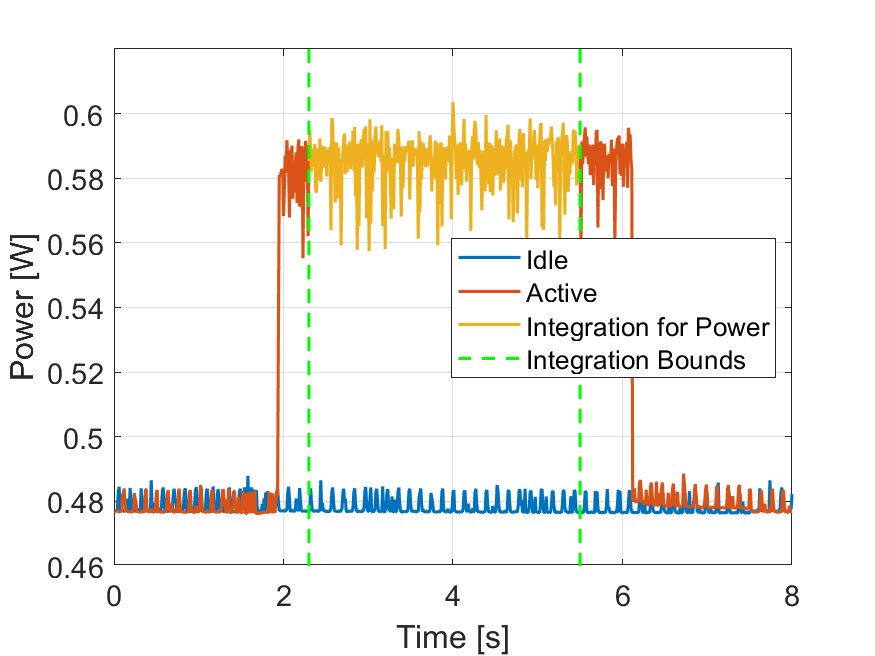
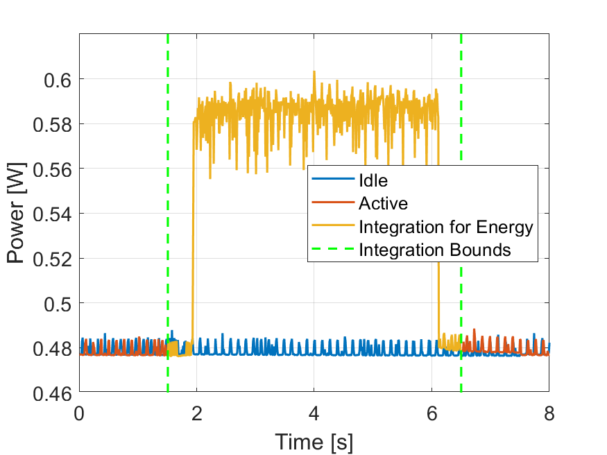
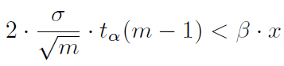

# OPEMS
Open Power and Energy Measurement Scrips

This readme contains all information about this repo containing detailed explanations and examplary scripts to perform power and energy measurements on NVIDIA GPUs and Intel CPUs. 

Please read this document carefully to get a feeling of how to perform scientifically correct and valid measurements. 

## Overview

In general, we measure the time/power/energy consumption of a certain **application (app)** on the **device-under-test (DUT)**, which could, e.g., be a smartphone, a TV, a PC, or a component of a device such as a CPU. The power/energy is measured by the **power meter (PM)**. Furthermore, we need a **control unit (CU)** to control and automize measurements. 

Scripts for measuring Intel CPUs with RAPL [2] are listed in ```IUNTEL_RAPL/```. Scripts for measuring the power on NVIDIA GPUs are provided in ```NVIDIA_SMI```. 

## Processing times

First of all: No, timing of a process is not a trivial thing. In fact, it is important to know which time is measured. Here is a list of the most important processing times one could measure: 
- **Elapsed time:** The real elapsed time that you would measure using your own watch (example: the linux time -p commant returning the real time)
- **CPU time**: The time a process spent on a certain (or cumulatively) on multiple CPUs. In parallel processing, this time is generally larger than the real time (example: time -p returning the user time).  
- **System time**: The time the CPUs spent on system processes not related to the target process (example: time -p returning the system time). Usually, we do not look at this in detail. 

Whenever you do time measurements, you should be aware of the type of time you are measuring. Especially when using different timing functions (clock() in C++, tic-toc in Matlab etc.), you should always know which time is measured. 

Furthermore, is is important to know whether (1) a process is performed in real-time, e.g., video playback with buffered decoding of frames for playback on a smartphone. Or (2) whether a process runs as fast as possible (e.g., encoding for storage on a server). These settings have a significant impact on the power behavior of the process. 

Note that in general, these terms shown here are not standardized and there is no common terminology in the literature. So be careful using and interpreting them. 


## Power and Energy Measurements

With the help of the time, we can now talk about energy and power measurements. For these, we usually take the elapsed time (that means the time a watch would measure). The phsyical relation between the elapsed time *t* in seconds, power *P* in Watts, and energy *E* in Joules is



 We can basically measure three kinds of different values that are best described by looking at a typical power consumption of a process shown below. 



In this plot, we can see the timeseries of the power consumption of an arbitrary app on an arbitrary DUT. The horizontal axis corresponds to the time and the vertical axis to the instantaneous power at the corresponding time. The blue line shows the power consumption when the measured DUT is idle and the red line the power of the app to be measured. In this example, the app starts at roughly 2s and ends at roughly 6s. The power consumption before and after the app corresponds to the idle power. The idle power can be measured to find out about the static power consumption of a process. The dynamic power is the additional power consumed when the process is running. The total power is the dynamic plus the static power. 

It is adviced to always record some time series of power measurements to have a feeling for the power consumption properties of the DUT and the app that is running on it. 

In our research, we are mostly interested in (1) mean powers during a stationary process without a predefined beginning and end (e.g., during video streaming), or (2) in energies consumed for a full process, often running at the highest possible speed (e.g., an entire encoding process of a video to be stored on a server). Both are visualized in the following. 

# Mean Power Measurement

Usually, these measurements are performed for apps that have an indefinite duration (e.g., video streaming). For these measurements, we often do not care about the power consumption during the launch or the exit of an app. As a consequence, a measurement is performed as shown in the next figure. 



In principle, the execution order is 
```
start app -> start measurement -> end measurement -> end app
```
which means that we record power data during the execution of the app. From the output data, we can then calculate the mean power by averaging all power values or by dividing the energy measured in this interval by the elapsed time. 


# Energy Measurement

Usually, energy measurements are performed for apps with a fixed beginning and end (e.g., encoding of a video). This means that we include the power consumption during the launch and the exit of the app. As a consequence, a measurement is performed as shown in the next figure. 



In principle, the execution order is 
```
start measurement -> start app  -> end app -> end measurement
```
which means that we record power data for the complete duration of the app. From the output data, we can then calculate the energy by integrating all power values over the elapsed time. Note that for fair comparisons, an idle energy must usually be subtracted to avoid errors introduced by the power consumed beforen the start and after the end of the app. 


## Statistical Validity

For statistical validity, each measurement should be repeated several times. As we are working with devices performing random processes in the background, e.g., due to the operating system (OS), this is required to obtain statistically significant results. Our standard way to ensure statistical validity is to perform a confidence interval test as follows: 



In this equation, *m* is the number of measurements, *x* the arithmetic mean of the measurements, and *&#963;* the standard deviation of the measurements. *&#945;* is the probablity, *&#946;* the relative confidence interval size, and *t_&#945;(m-1)* the critical t-value for *m* samples from Student's t-distribution. We often use *&#945;*=0.99 and *&#946;*=0.02, which for the case of energy measurements means the following: 

```
With a probability of at least 99%, the true energy is not lower than 0.99 times and not higher than 1.01 times the measured mean energy *x*.
```

## Good Scientific Practice

Furthermore, for all your measurement, it is good to follow some good-scientific-practice rules: 

- Make sure that your measurements can be reproduced. 
- Before mean power or energy measurements, perform a timeseries power measurement of the process and check the power-time curve for plausibility. It is also a good idea to record such a power-time curve for any report/thesis. 
- Check all results for plausibility. 
- Crosscheck measurements which do not satisfy the statistical validity test. Try to find out why it is not statistically valid. 
- Define the system setup in detail ((state of) Internet connections, screen brightnesses, runlevel, state of background processes, OS version, ...) and find ways to set these automatically before the measurement, if possible. 
- For more details and in-depth understanding of common issues related to energy measurements, please refer to the literature [1]. 


## Power Meters

Currently, scripts for the following power meters are available: 
- **Running-Average Power Limit (RAPL)** [2]: Internal power meter of Intel CPUs (measures the energy for CPU, unCPU, and package). Only runs on Linux PCs. 
- **NVIDIA SMI** [3]: Internal power meter for NVIDIA GPUs. Only runs on Linux PCs. 

In this repo, you can find example scripts for Python and Matlab. 

## Acknowledgment
Thanks to Geetha Ramasubbu, Lena Eichermüller, Xinyi Wang, Matthias Kränzler, and Alireza Siavashi for providing scripts and feedback. 

## References

[1] Herglotz, C., Katsenou, A., Wang, X., Kränzler, M., & Schien, D. (2025). Foundations of Measuring Power and Energy Consumption in Video Communication. IEEE Access.
[2] https://www.intel.com/content/www/us/en/developer/articles/technical/software-security-guidance/advisory-guidance/running-average-power-limit-energy-reporting.html (last accessed 2025-03-20)
[3] https://developer.nvidia.com/system-management-interface (last accessed 2025-03-20)
